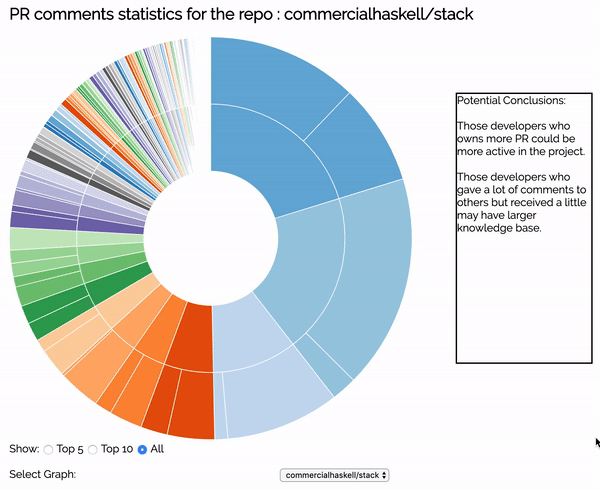

# This is for CS3012 Software Engineering project.

## Introduction:
The purpose of this project is to measure the comments of pull request (PR) of a repo on github. In my measurement report I wrote:

  *Developers who like to write comments when conflicts are happening or some other engineers are facing troubles on their codes, are good communicators and also may have larger knowledge base. This kind of people usually have potential leadership abilities.*

So this project is to show who left more comments to the others, and how many comments they received.

This project was built with javascript and HTML. The repos commercialhaskell/stack and arduino/Arduino(open source) were selected for this project.

## Libraries:
- jquery.js -- basic library for js.
- pouchdb-7.0.0.js -- useful tool to connect to database in js.
- pouchdb.find.js -- lib for pouchdb query.
- d3.v4.min.js -- d3 visualization lib.
- d3-tip.js -- Tooltips for d3 visualizations.

## Database:
The data collected and produced by these programs are stores in the IBM Cloudant database.

## Codes:
- get_comments.html & get_comments.js -- This program could automatically collect all the comments for all the pull requests of a repo, and stored them into database. This program may run a little bit slow, at a speed about 1000PRs per 30mins, but send requests to github api could trigger the abuse mechanism if send more than 50 requests per min.

  Usage:

  - Set the `databaseAddress` var to your database address.

  - Set the `repo` var to the repo you want to get.

  - Set the `headerToken` var to your github personal token.

- process_comments.html & process_comments.js -- This program will read the collected data from the database and process them, then put the final data back to the database. The final data is used to show in the graph.

  Usage:

  - Set the `collectedDataAddress` var to the database address that contains the raw data.

  - Set the `dataToShowAddress` var to the database address to put the processed data.

- graph.html -- This draws a sunbrust graph using d3 visualization lib, shows how many PRs each developer owns and how many comments they received and gave.

## example:

